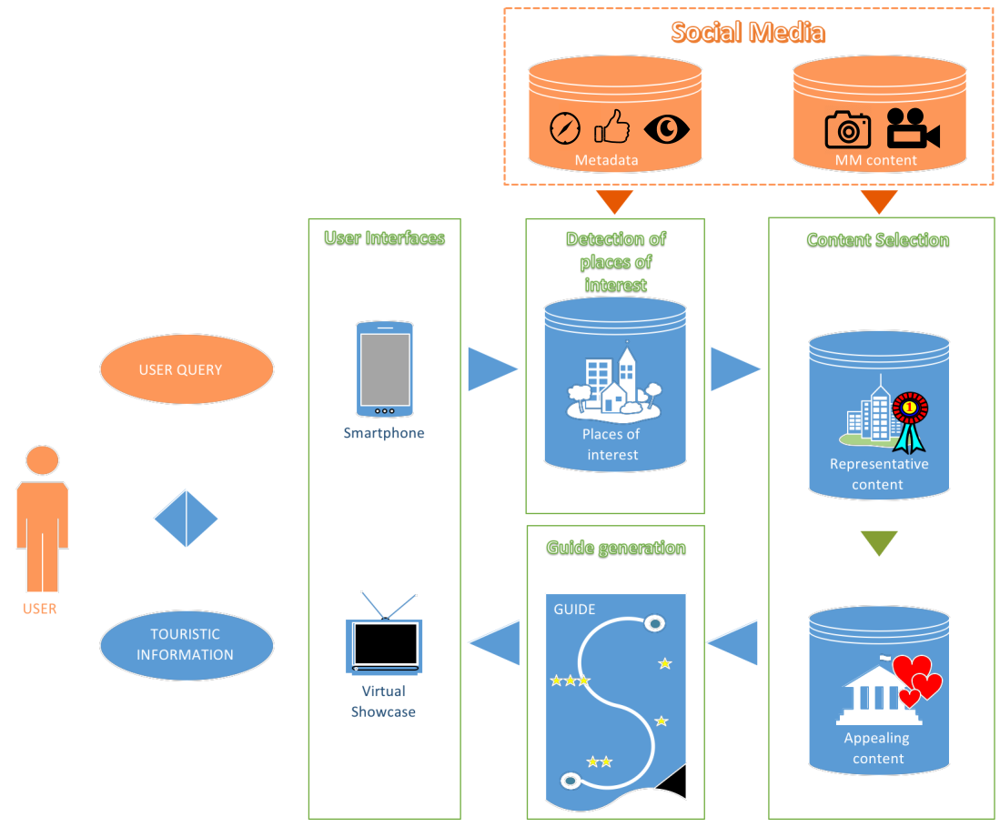

# ESITUR-Jerez data collection
---

The dataset introduced here has been used in our paper:

Kleinlein, R.; García-Faura, Á.; Luna Jiménez, C.; Montero, J.M.; Díaz-de-María, F.; Fernández-Martínez, F. Predicting Image Aesthetics for Intelligent Tourism Information Systems. Electronics 2019, 8, 671.

The figure below displays the main modules of the general framework of the ESITUR project. 
The aim of this project is to develop a system capable of automatically retrieve high-quality audiovisual content for a given location and present it to new users through their smartphones in order to appeal them to visit a given spot. 
The information displayed (either in a smartphone or in a virtual showcase) is continuously updated as social media are regularly checked in search of new multimedia content and/or new metadata (GPS coordinates, reviews, comments, number of views, positive or negative reactions, etc.). 
This collected data is then processed in 2 steps: 
First, relevant and representative content is identified from both new material uploaded by the users and the reaction to the multimedia content already present in the system.
Afterwards, the resources identified as highly representative and relevant to the community are evaluated in terms of their aesthetics value.
The aesthetics value here must be understood as a combination of the aesthetics quality and the suitability of a multimedia resource for touristic promotion. 
A demonstration of a preliminary system working is available in [here](https://youtu.be/lvKL-GD5beM). 
This way, the introduction of places with touristic interest to potential visitors can be done after an automatic selection of the available content that offers the best possible view of a destination as perceived by most other visiting people. 
For instance, let us suppose we are weighting two possible touristic routes: 
Route A includes a place with an aesthetic score of 9 whereas route B has two places with scores 6 and 8 respectively. 
Option B may be discarded given that the average score is lower than route A’s. 
This ranked content is accessible to the users through mobile devices, but in order to provide relevant material, an accurate selection of those resources is fundamental.

A collaborative annotation process was carried out online. Each user was presented with 50 randomly selected images, each along with the question of whether it was suitable or not, in terms of aesthetics, for the touristic promotion of the town (e.g., by including it in a touristic guide). A total of 232 people participated, so each image has on average about 12 annotations.
An image is considered to have a high aesthetics score if at least half of the annotators considered it suitable for the touristic promotion of the town, otherwise it is tagged with a low score